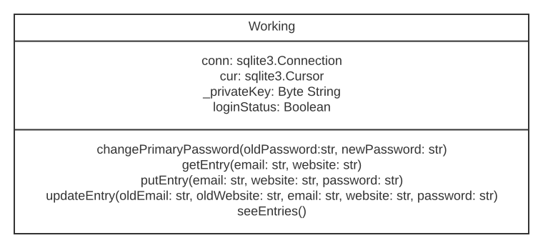

# SimplePasswordManagerBackend

- The backend part of the simple password manager project.
- Your task will be to showcase your creativity on our channel by making a GUI application of the password manager with Python.
- This backend will help you to be chill about the backend working for now so you can focus on frontend part right now.
- You do not need to worry about the security, that's done with this backend module.

## Class Diagram of the Working class

## About the challenge

- You only need to import the working class use it for making your own password manager app(GUI apps only).
- Make this app, upload on GitHub and tag us on our social and we will review your code and give you a shoutout.
- Keep the link of the repo in the post and tag us on the social media.
- You have total freedom to develop the app of your design. Just do not be abusive because we cannot show such content on our channel. Be PG13.
- You can see our password manager app made with PyQt5 using the [tutorial link](https://www.youtube.com/watch?v=gT3lyaaH6xM&list=PLK59HDBUP-dtptgL7IAPGMuy2KSo75MxM&index=6) 
- For knowing more on how this backend is made, you can follow our [Simple Password Manager tutorial](https://www.youtube.com/watch?v=3HxxctBDr3Q&list=PLK59HDBUP-dtptgL7IAPGMuy2KSo75MxM&index=5)
- [PyQt5 documentation](https://www.riverbankcomputing.com/static/Docs/PyQt5/)
- [PyQt5 tutorial](https://www.riverbankcomputing.com/static/Docs/PyQt5/)
- We have used PyQt5 for the tutorial because it is the most popular Python GUI framework. You are however free to use GUI framework of your choice. Just a suggestion that Tkinter will not be good because this will be a big project.

## Code Examples to work with the backend module.

- Installing the module

        pip install simplepasswordmanagerbackend

- Use pip3 if the name of pip is given that way.

- Importing the setup function

        from SimplePasswordManagerBackend import setupDatabase

- Setting up the database with primary password

        setupDatabase(primaryPassword) 

- Importing the working class

        from SimplePasswordManagerBackend import Working

- Making the working object

        working = Working(primaryPassword)

- It will encrypt the password and check if it is ok or not.

- Checking if password entered was correct or not

        if working.loginStatus:
            # Login succesful. Password was right.
        else:
            # Password was wrong. Login not succesful.

- Changing primary password of the database

        working.changePrimaryPassword(oldPassword, newPassword)

- Getting an entry from database

        working.getEntry(email, website)

- This will return the password in string format. 

- Putting an entry from the database 

        working.putEntry(email, website, password)

- This method will return a boolean based on entry is done in the database.

- Updating an entry

        working.updateEntry(oldEmail, oldWebsite, email, website, password)

- Returns nothing. Just updates the database.

- To see the entries present in the database.

        working.seeEntries()

- This returns entries in list of (email, password).
- Will return all the tuples of email and website present in the database.